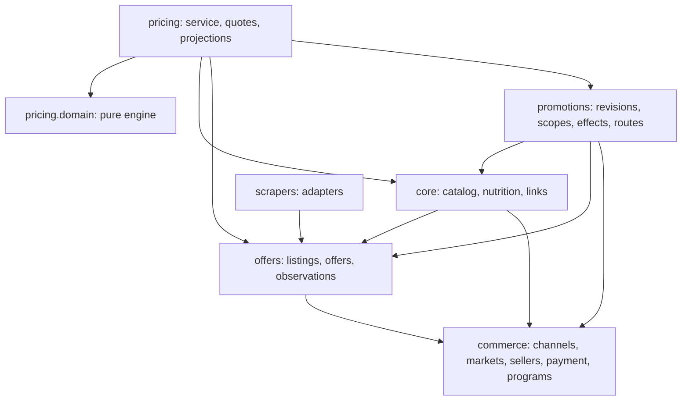
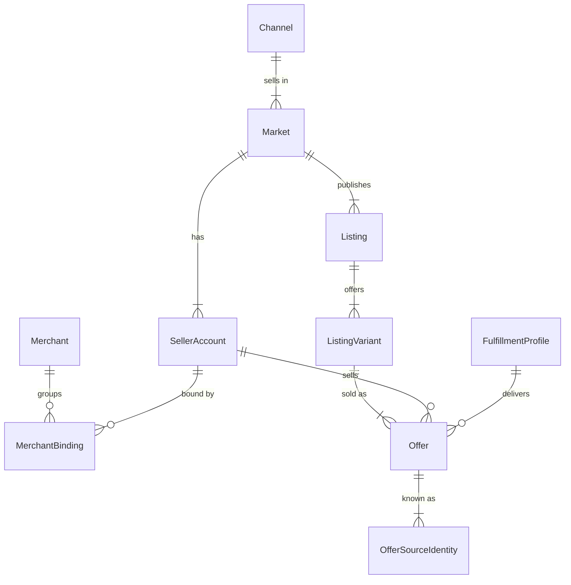
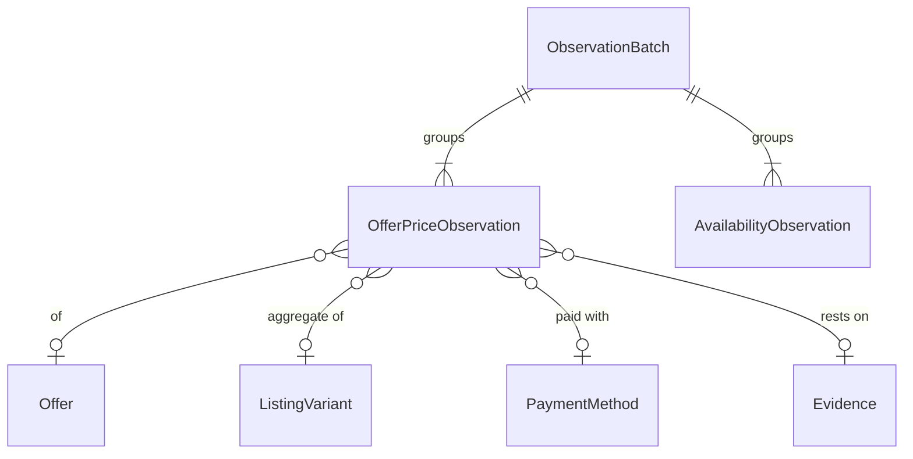
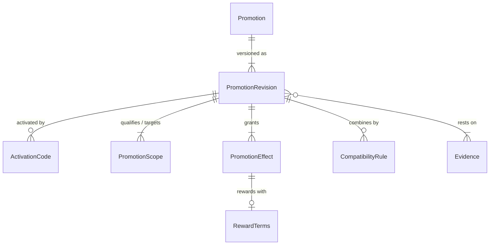

# Pricing model

The full model of who sells what, what it costs in which context, which
promotions change that, and how the catalog ranks the result. Every entity
below is part of the design; [pricing-migration.md](./pricing-migration.md)
says in which delivery each one is built and how today's data moves into it.

Names are final unless a delivery documents a rename. "Table" means a Django
model; "typed structure" means a validated, versioned JSON document or an
immutable dataclass, never an unvalidated dictionary.

## Apps and dependencies

- `commerce` is new and neutral: it imports only `common`.
- `offers` imports `commerce` and `common`, never `core`, `promotions`,
  `pricing` or `scrapers`. This replaces the rule "offers depends only on
  common"; the rule that matters, offers never knows the catalog, stays.
- `pricing.domain` imports neither Django nor any app. It takes `now` as an
  argument and never reads the clock, the database or the network.
- `core.models` never imports `promotions` or `pricing`. The ranking selector
  reads `pricing` projections through `pricing.selectors`, which `core`'s REST
  view composes; no model-level cycle.
- Normalizers stay pure: payload in, DTO out, no ORM.
- An import-boundary test enforces each rule above.

## Commercial identity (`commerce`, `offers`)

| Entity | Kind | Fields that carry meaning | Guarantees |
| --- | --- | --- | --- |
| `Currency` | table | `code` (ISO 4217), `minor_unit` | Precision per currency, never assumed two places |
| `Channel` | table | `kind` (independent_store, marketplace, app), `name`, `adapter` | One engine for stores and marketplaces |
| `Market` | table | `channel`, `country` (ISO 3166-1), `currency`, `timezone`, `namespace`, `tax_inclusion` | Same external id in two markets never collides; taxes are zero only where prices include them |
| `SellerAccount` | table | `market`, `external_id` (nullable), `name_raw`, `is_channel_owner`, `resolution` (resolved, unresolved) | A seller is an id inside a market, never a name; an unresolved seller is explicit |
| `Merchant` | table | `name` | Optional curated grouping |
| `MerchantBinding` | table | `merchant`, `seller_account`, `evidence`, `verified_at` | Accounts are joined only by a curated, evidenced binding |
| `FulfillmentProfile` | table | `market`, `kind` (seller, channel, third_party, unknown), `label_raw` | Who ships is a fact, not inferred from the channel |
| `Listing` | table | `market`, `external_id`, `url`, `title`, `catalog_product_id` (the channel's own catalog id, e.g. an ASIN or a catalog product) | A page or advertisement, distinct from the canonical product |
| `ListingVariant` | table | `listing`, `external_id`, `options` (typed), `gtin`, `selection` (typed) | The selectable unit; flavor and package live here |
| `Offer` | table (existing, extended) | `listing_variant`, `seller_account`, `fulfillment_profile`, `item_condition` (new, used, refurbished, unknown), current projections | One buyable proposal of one seller for one unit |
| `OfferSourceIdentity` | table | `offer`, `namespace` (market namespace), `scheme` + `scheme_version`, `key` | Unique `(namespace, scheme, key)`; aliases survive scheme changes |

Rules:

- **Identity excludes** price, stock, timestamps, cashback rate and featured
  position. Currency, destination and payment method belong to observations,
  not to a new offer.
- **Identity includes** whatever distinguishes alternatives a buyer can choose
  at the same time: listing, variant, seller, condition and fulfillment when the
  source distinguishes them. Each adapter documents its key scheme.
- **Missing seller.** A price the source publishes without naming a seller is
  an observation of the `ListingVariant` (aggregate), not of an offer. It is
  never attributed to a seller, nor merged later without reconciliation.
- **Featured offer.** A buy box or default seller is a `FeaturedOfferObservation`
  (listing variant, offer, observed_at): a selection that changes, never
  identity, and never proof that all offers were enumerated.
- **Independent store.** One channel of kind `independent_store`, one market,
  one `SellerAccount` with `is_channel_owner`. The same tables, no second path.
- **Catalog binding.** `core.Store` gains `seller_account` (and, for a store
  with several accounts, a `StoreAccount` table). `ProductStore` keeps linking a
  product to one offer. Names in the API do not silently change meaning.
- **Same name, other market.** GTIN, channel catalog id and title are evidence
  for curation. They never merge two canonical products, because a package sold
  in another country may print another table.

## Collection (`offers`)

| Entity | Kind | Fields | Guarantees |
| --- | --- | --- | --- |
| `ObservationBatch` | table | `adapter`, `adapter_version`, `market`, `started_at`, `finished_at`, `status`, `request_context` (typed: endpoint, region, postal code hash, sales channel) | Prices read together stay together |
| `CollectionCoverage` | table | `batch`, `dimension` (variants, sellers, offers, payment_prices, availability, pagination), `partition` (listing, category, page range), `status` (complete, partial, failed, access_unavailable), `reason`, `cursor` | Absence is evidence only within a complete partition of that dimension |
| `Evidence` | table | `kind` (catalog_response, cart_quote, product_page, regulation, announcement, theme_setting, manual), `source_url`, `observed_at`, `excerpt`, `content_hash`, `captured_by` | Records what was proven, without storing page HTML |

- `CollectionCoverage` replaces `complete_unit_list`. A complete variant list
  with partial sellers never delists a seller. A ranked search, a top-N list or
  a buy box is never complete for offers. 403, 429 and parse failures keep
  history and mark the dimension `failed` or `access_unavailable`.
- Rate limits and quotas belong to the adapter and the account, scheduled per
  provider; spacing monitors by hand does not scale past eight stores.

## Observations (`offers`)

`OfferPriceObservation` (table, append-only):

| Group | Fields |
| --- | --- |
| Subject | `offer` or `listing_variant` (exactly one, check constraint), `batch` |
| Money | `amount` (Decimal, 6 places, source precision), `currency`, `amount_basis` (unit, line, order) |
| Meaning | `role` (reference, payable), `capture_stage` (catalog, product_page, cart, checkout), `evidence_level` (advertised, observed_in_catalog, quoted_for_context), `semantics` (known, legacy_unknown) |
| Payment | `payment_method` (nullable: unknown is not "any"), `payment_provider_raw`, `payment_label_raw`, `installment_count`, `installment_amount`, `total_payable`, `interest_status` (free, charged, unknown), `first_due` (unknown allowed) |
| Quantity | `quantity_min`, `quantity_max` |
| Context | `condition_key` (hash of the normalized context dimensions, never amount or time), `destination` (typed, coarse), `membership_program`, `tax_inclusion` (included, excluded, unknown) |
| Source | `source_field`, `adapter_version`, `evidence` |
| Time | `observed_at`, `recorded_at`, `valid_until`, `fresh_until` |
| Composition | `composition_status` (known, partial, unknown), `included_adjustments` (typed list: kind, amount, source id) |
| Derivation | `derived_from` (nullable self FK) and `derivation` (advertised_rate): a value computed from an announced rate is never stored as observed |

Payment terms are columns of the observation, not a separate table: a terms
row would never be shared between observations, and columns keep the ranking
query a plain filter. Nothing is lost; the grouping is in the field names.

`AvailabilityObservation` (table, append-only): `offer`, `batch`, `status`
(available, last_units, out_of_stock, preorder, backorder, unknown),
`quantity`, `destination` (nullable: stock is not deliverability),
`observed_at`. `StockStatus.purchasable()` is the allowlist the ranking uses;
a new state starts outside it. `StockReading` loses its optimistic
`AVAILABLE` default: a source that says nothing is `unknown`.

`Offer` keeps `current_price`, `current_stock_status` and `last_seen_at` as
compatibility projections with a known market, currency and policy. They are
written only by ingestion; the admin never writes the same fact.
`PriceObservation` stays read-only for history until the cutover.

## Payment, programs and eligibility (`commerce`)

| Entity | Kind | Fields | Guarantees |
| --- | --- | --- | --- |
| `PaymentMethod` | table | `family` (card, instant_transfer, bank_slip, wallet, deferred, store_credit, other), `code` (e.g. `pix`), `market` (nullable) | Pix is a method in the BR market, not a phase of the engine |
| `PaymentProvider` | table | `name`, `kind` (acquirer, wallet, issuer, gateway) | Card brand and gateway are not fields per brand |
| `Program` | table | `issuer` (seller account, channel, bank, platform), `kind` (cashback, loyalty_points, membership, subscription, card_benefit), `market`, `unit` (currency or points name) | "New on the channel", "new to the seller" and "new to the programme" stay apart |

Eligibility claims of a buyer ("I am new here", "I hold this card programme")
exist only in a `PurchaseContext`, never in a table.

## Promotions (`promotions`)

| Entity | Kind | Fields | Guarantees |
| --- | --- | --- | --- |
| `Promotion` | table | `issuer` (seller account, channel or program), `funder_raw` (optional), `title`, `source_key` (idempotent identity per issuer/campaign), `active_revision` | Stable identity; a code alone is never a global key |
| `PromotionRevision` | table | `number`, `status` (draft, informative, executable, suspended, archived), `starts_at` / `ends_at` (start inclusive, end exclusive; null end = unknown, not forever), `timezone`, `verified_at`, `review_by`, `conditions` (typed tree), `ordering` (typed DAG of effect precedence), `limitations`, `content_hash`, `published_at` | Published content is immutable; an edit is a new revision |
| `ActivationCode` | table | `revision`, `code`, `kind` (automatic, public_code, personal_code, balance_redemption, required_action), `channel_scope`, `is_private` | Private codes never reach projections |
| `PromotionScope` | table | `revision`, `role` (qualification, target), `mode` (include, exclude), `kind` (channel, market, seller_account, merchant, brand, category, product, listing, listing_variant, offer, external_category), `ref_id` / `external_ref`, `combine` (union, intersection) | Exclusions win; qualifier and target sets are distinct |
| `PromotionEffect` | table | `revision`, `kind` (percentage, fixed_amount, fixed_price, shipping_discount, cashback, points, gift, multibuy, tiered), `stage` (catalog, order, payment, shipping, reward), `basis` (initial, current, eligible_subtotal, order_total, component), `target` (item, line, group, order, shipping), `allocation` (per_unit, per_line, once, prorated), `parameters` (typed per kind), `currency`, `cap`, `max_applications`, `consumes_units` | Percent in 0..100, money non-negative, currency required for fixed values, no cyclic basis |
| `RewardTerms` | table | `effect`, `program`, `credited_as` (money, restricted_credit, points), `eligible_basis`, `rate`, `cap` + `cap_period` (transaction, month, campaign), `minimum`, `tracking_required`, `activation_route`, `credit_delay`, `delay_from` (purchase, delivery, confirmation, statement), `expires_after`, `redemption_minimum`, `cancellation_terms` | Future money, points and credit stay apart; remaining cap is unknown unless assumed |
| `CompatibilityRule` | table | `revision`, `other_kind` (revision, promotion, effect_kind, program), `other_ref`, `verdict` (allowed, forbidden, unknown), `chooser` (store_imposed, buyer_choice), `evidence` | Specific rules beat defaults; contradictions block publication |
| `PurchaseRoute` | table | `offer` or `listing`, `kind` (direct, affiliate, cashback_activation, marketplace_listing), `program`, `url`, `fixes_variant`, `fixes_seller`, `compatible_programs`, `instructions`, `evidence` | The buy button reproduces the priced scenario, or says it cannot |

Immutability:

- Scopes, codes, effects, reward terms and compatibility rules are child rows
  owned by one revision. Nothing a revision points at is shared and mutable.
- Publishing computes `content_hash` over a canonical snapshot of the revision
  and its children. A database trigger and the model layer refuse any update or
  delete of a published revision or its children; archiving is a status.
- Scopes that name a catalog category or brand resolve membership at
  evaluation time; a persisted quote stores the resolved offer set, so a later
  category change never rewrites an old explanation.
- Admin, MCP and jobs call one `PromotionService`: `draft`, `validate`,
  `publish`, `suspend`, `archive`, `simulate`. MCP reaches it through the same
  ModelAdmin, with the same permissions; no agent-only flow.

Conditions are a typed tree in the revision (`all`, `any`, `not`, and leaves:
min_amount with its basis, min_quantity, channel, market, seller, destination,
payment_method, program_member, subscription, new_customer of an issuer,
calendar, code_required). Depth and node count are capped. Leaves evaluate to
`true`, `false` or `unknown`: in `all`, false wins, then unknown; in `any`,
true wins, then unknown; `not unknown` is unknown. No expression from the
database is ever executed.

A tree stays a typed document rather than a table per node: it is read whole,
validated whole and hashed whole, and no query filters by a leaf. Leaves that
need integrity (a seller, a program) carry ids the validator checks.

## Purchase and quotes (`pricing`)

Typed structures of `pricing.domain`, persisted only inside a quote snapshot:

| Structure | Contents |
| --- | --- |
| `PurchaseContext` | `now`, `market`, `currency`, `lines`, `payment` (method, provider, installments), `destination` (country, subdivision, city, postal code as text), `codes`, `programs`, `claims` (each with provenance: user, observation, assumption, default), `scenario`, `policy` |
| `CartLine` | offer or listing variant, quantity |
| `CheckoutGroup` | lines checked out together, as the adapter declares the channel allows (one seller, several sellers, several shipments) |
| `PricingResult` | selected observations, `merchandise_total`, `shipping_total`, `tax_fee_total`, `total_payable`, `due_now`, `payment_schedule`, `adjustments`, `deferred_rewards`, `estimated_net_cost` (policy permitting), `decisions`, `assumptions`, `missing_context`, `purchase_route`, `input_fingerprint`, `engine_version`, `evaluated_at`, `expires_at`, `optimization_status` (complete, bounded) |
| `Adjustment` | effect and revision, basis amount, amount, target, order, allocation per line |
| `DeferredReward` | reward terms, estimated amount or units, `credited_as`, conditions |

Every decision about a candidate carries one status: `applied`, `ineligible`
(a condition is false), `unknown` (data missing), `unsupported` (the engine
does not implement it), `conflict`, `stale`, `access_unavailable`. A failed
integration never yields a zero discount or a false availability.

Tables:

| Entity | Fields | Guarantees |
| --- | --- | --- |
| `PricingPolicyRevision` | `key`, `number`, `market`, `rules` (typed: purchasable states, accepted roles, stages and evidence levels, excluded condition kinds, quantity, freshness per source), `published_at`, `content_hash` | Every ranking names the immutable policy it used |
| `PricingQuote` | `context_fingerprint` (no postal code or private code in clear), `snapshot` (inputs, resolved scopes, result), `engine_version`, `policy_revision`, revision and observation references, `evaluated_at`, `expires_at` | Reproducible: the same input, version and instant give the same result |
| `QuoteLine` | `quote`, `offer`, `quantity`, merchandise and allocated amounts | Queryable per offer without parsing snapshots |
| `ShippingQuote` | group fingerprint, seller account, destination (country, subdivision, postal code hash), modality, packages (typed), amount, currency, estimate, source, `observed_at`, `expires_at`, included benefits | Quantity, seller, value and modality are part of the quote, not just offer + postcode range |
| `TaxFeeQuote` | group fingerprint, component kind, base, amount, inclusion, source | Taxes already in a price are never added again |
| `OfferScenarioProjection` | `offer`, `market`, `policy_revision`, `currency`, `amount`, `status`, `observation`, `fingerprint`, `computed_at`, `expires_at` | Ranked and paginated in the database, before pagination |
| `FeaturedOfferObservation` | `listing_variant`, `offer`, `observed_at`, `batch` | A buy box is an observation |

`ShippingQuote` and `TaxFeeQuote` are observations
or adapter results; the project does not build a world tax calculator.

## Engine (`pricing.domain`)

`evaluate(context, observations, revisions, policy, now) -> PricingResult`.

1. Validate currency, identity, quantity, availability and context.
2. Select observations matching the scenario, fresh under the policy.
3. Recognize adjustments already included; never apply them again.
4. Filter revisions in force at `now` (market timezone, end exclusive);
   split false, unknown and unsupported conditions.
5. Build the combinations compatibility allows; reproduce store-imposed
   choices, enumerate buyer choices up to a bound.
6. Apply effects by stage and the revision's precedence DAG, consuming units
   and caps; cycles are rejected at publication.
7. Add shipping and fees when known, per checkout group.
8. Compute deferred rewards on their own basis; never reduce the total payable.
9. Produce totals, allocations (largest remainder, stable tie-break),
   explanations and validity.

Money is `Decimal` end to end; rounding happens per currency at defined
points; amounts in different currencies never add up. Allocations sum exactly
to the discount. A discount never exceeds its eligible basis.

Mechanics implemented in delivery 5: percentage, fixed amount, fixed price,
shipping discount, cashback, points, gift (quantity and identity, no money
value), multibuy with a selection and consumption policy, quantity tiers, and
subscriptions with a known horizon and schedule. A kind or a term set outside
these is `unsupported`. The engine never redeems, credits or buys.

## Ranking and API

- A ranking names its market, scenario, policy revision and currency. A visitor
  with no destination is never promised delivery.
- Per offer, `OfferScenarioProjection` holds the amount under each public
  policy. The product's winner is chosen among all its eligible offers after
  flavor, package and seller filters, then products are sorted and paginated
  in the database.
- Personal contexts (codes, programs, destination) are evaluated on demand
  over the declared candidate set, with a cache keyed by a fingerprint that
  exposes no postal code or code.
- Recomputation is idempotent, queued after commit, on price, availability,
  revision, scope, link or policy change; expiry is checked at read time too.
- The public frontend stays in Vue and shows seller, channel, variant, market,
  currency, conditions, observation time, payment terms and the breakdown;
  merchandise, delivered total, estimated net cost and installment stay
  distinct labels.

## Adapters

Each adapter declares versioned capabilities: variant enumeration, seller
enumeration, payment prices, cart quote, destination delivery, rewards,
selectable route. Capabilities are per source and context, not promises about
a platform. A store on a supported platform is configuration; a new protocol
is a new adapter with fixtures; a new commercial mechanic is a new registered
evaluator. No `if store_slug ==` exists in the engine, selectors or money
rules. Configuration never executes code. Amazon and Mercado Livre adapters
need authorized access; until then they exist only as synthetic contract
fixtures, labelled as such.

## Local second-review implementation

`pricing.facts` owns ORM fact loading and translation; `pricing.costs` resolves
current shipping alternatives and charge versions; `pricing.context` assembles
inputs shared by quotes and projections. `PricingService` evaluates contextual quotes. `domain/base_prices.py` and `domain/scopes.py` isolate base selection and
qualification/benefit reach from engine orchestration.

`promotions.rules` is a pure module below promotion publication and the
engine. Its `EffectSpec` registry states, per effect kind, the stages,
targets, bases, allocations, cap and application limit its handler applies;
publication refuses anything else and the engine marks it unsupported. Condition
leaf traversal is shared for normalized documents; Pydantic schema validation
still walks its typed representation separately.

Scraper `PriceInput` rejects unknown keys and validates quantity ranges, amount
basis, currency and a closed observation context. Unit, line and order bases
survive ingestion; the current engine explicitly refuses non-unit bases and
reports restricted contexts as unknown. Extra observation dimensions require
an intentional contract change, rather than silent dropping.

A charge version is identified by group, source, kind, currency and `charge_key`.
An empty charge key preserves the legacy same-charge identity; two independent
charges must use different keys. Shipping versions use group, seller, source,
modality and currency. Old versions remain candidates only with a nonempty
external quote ID and `execution_guaranteed=True`. Expired replacements do not
revive older unguaranteed observations. Future observations are excluded.
