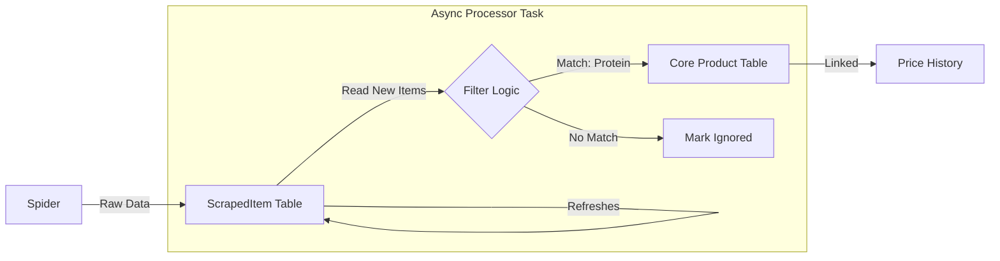

# Scraping Architecture V2: Staging & Promotion Strategy

## Overview
We have implemented a **Hybrid Ingestion Strategy** to solve the "data overload" problem. This architecture separates **Data Collection** (Scraping) from **Data Curation** (Product Catalog).

### Current Flow (Implemented)
1.  **Spider** runs and extracts data.
2.  **Service** (`save_product_from_datalayer`) processes data:
    *   **IF Linked (Known Product):**
        *   Updates `ProductPriceHistory` (maintains price/stock history).
        *   Updates `ScrapedItem` (raw data view).
    *   **IF New (Unknown Product):**
        *   Creates/Updates `ScrapedItem` only.
        *   **Does NOT** create a `Product` in the core table.

---

## Proposed Phase 2: The "Processor" Task (The Solution)

To "update the core" without overloading it, we introduce a separate, asynchronous **Processor Task**.

### Concept
Instead of the Spider deciding what is a "Protein" (which is hard/flaky), we leave that to a specialized background task that runs *after* scraping (or periodically).

### Architecture Diagram


### Strategy Options for Updating Core

#### Option A: "Real-Time" (in Spider)
*   **Logic**: Spider checks "Is this protein?" immediately.
*   **Pros**: Instant.
*   **Cons**: Slows down scraping. Hard to change rules later (need to rescrape to fix). **Not Recommended.**

#### Option B: "Post-Scrape Hook" (Triggered)
*   **Logic**: When Spider finishes, it triggers `process_new_items`.
*   **Pros**: Fast feedback loop.
*   **Cons**: Complexity in chaining tasks.

#### Option C: "Periodic Batch" (Recommended)
*   **Logic**: A Celery beat task runs every 1 hour (e.g., `process_staging_area`).
*   **Steps**:
    1.  Query `ScrapedItem.objects.filter(status='new')`.
    2.  For each item:
        *   **Rule Engine**: Check Name/Category against rules (e.g., "Contains 'WHEY'", "Category='Proteina'").
        *   **Pass**: Create `Product`, Link `ProductStore`, Create `ProductPriceHistory`. Update `ScrapedItem` status to `LINKED`.
        *   **Fail**: Update `ScrapedItem` status to `IGNORED` (or leave as `NEW` if unsure).
*   **Pros**: 
    *   **Performance**: Doesn't block scrapers.
    *   **Iterative**: You can improve the "Filter Rules" and re-run them on old data to find things you missed!
    *   **Safety**: Staging table acts as a safe buffer.

---

## Technical Design for the Processor

### `scripts/process_staging.py` (or Celery Task)
```python
def process_staging_items():
    items = ScrapedItem.objects.filter(status='new')
    for item in items:
        # 1. Classification Rule
        if is_protein(item):
            promote_to_product(item)
        else:
            # item.status = 'ignored'
            # item.save()
            pass

def is_protein(item):
    # Flexible logic
    keywords = ['whey', 'protein', 'isolado', 'concentrado']
    name_lower = item.raw_data.get('item_name','').lower()
    return any(k in name_lower for k in keywords)
```

## "Maintaining History" (`ScrapedItem` vs `Core`)
*   **Core Products**: We maintain full `ProductPriceHistory`.
*   **Staging Items**: Currently, `ScrapedItem` only keeps the *latest* snapshot. 
    *   *Advice*: This is usually sufficient for "junk" data. If you promote an item later, you start tracking history *from that point*.
    *   *Advanced*: If you absolutely need history for non-promoted items, we would need a `ScrapedItemHistory` table, but this will grow HUGE very fast. **Recommendation: Stick to latest-only for staging.**

## Conclusion
The **Batch Processor (Option C)** is the best fit. It allows you to:
1.  Scrape everything (Broad nets).
2.  Filter strictly (Clean database).
3.  Change your mind later (Re-process staging data to find "Creatine" later without re-scraping).
