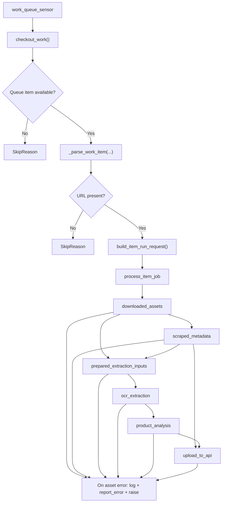
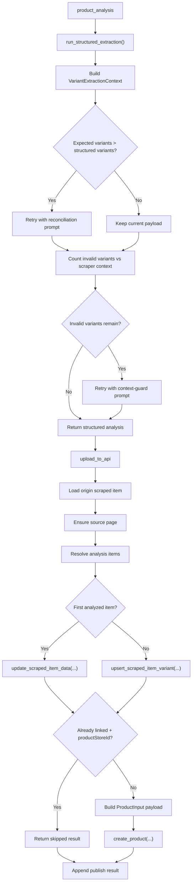

# Agents Pipeline

This document describes the current Dagster pipeline implemented in
`services/agents`.

It is intentionally code-driven: the goal is to translate the current runtime
behavior into technical prose, not to describe an aspirational design.

## Purpose

The agents pipeline processes one queued scraped item at a time and attempts to:

1. normalize the source page relationship for the queued item
2. download and persist lightweight source artifacts
3. extract lightweight metadata from the page
4. run OCR or text-only multimodal extraction
5. convert raw extraction text into structured product analysis
6. create or update downstream products in the backend API

The pipeline is orchestrated by Dagster, but most of the domain work happens in
plain Python modules under `agents/brain`, `agents/tools`, `agents/storage`, and
`agents/client.py`.

## Runtime Entry Point

The Dagster code location entrypoint is:

- [definitions.py](/home/rafael/Documents/baboom/services/agents/agents/definitions.py)

That module assembles:

- all assets via `load_assets_from_modules(ASSET_MODULES)`
- one asset job: `process_item_job`
- one sensor: `work_queue_sensor`
- three shared resources:
  - `client`
  - `scraper`
  - `storage`

The effective code location object is `defs = Definitions(...)`.

## High-Level Flow

At a high level, one run looks like this:

1. `work_queue_sensor` polls the backend queue
2. the sensor receives one checkout payload from the backend API
3. the sensor normalizes that payload into a `QueueWorkItem`
4. the sensor creates a `RunRequest` with run config for the item
5. Dagster launches `process_item_job`
6. the asset graph executes in this order:
   - `downloaded_assets`
   - `scraped_metadata`
   - `prepared_extraction_inputs`
   - `ocr_extraction`
   - `product_analysis`
   - `upload_to_api`

## Flowcharts





## Pipeline Contract

The shared launch contract for queue-triggered runs lives in:

- [pipeline.py](/home/rafael/Documents/baboom/services/agents/agents/defs/pipeline.py)

### Job Name

The job name is fixed as:

- `process_item_job`

### Per-Run Config

Each launched run receives the same config payload for these assets:

- `downloaded_assets`
- `product_analysis`
- `upload_to_api`

The shared config shape is:

```python
{
    "ops": {
        op_name: {
            "config": {
                "item_id": int,
                "url": str,
                "store_slug": str,
            }
        }
    }
}
```

This config is built by `build_item_run_config(...)`.

### Queue Item Model

The normalized launch payload is the `QueueWorkItem` dataclass:

```python
QueueWorkItem(
    item_id: int,
    url: str,
    store_name: str,
    store_slug: str,
)
```

### Run Identity

Runs use:

- `run_key = str(item_id)`

This means the queue item ID is the deduplication identity for Dagster run
launches.

## Sensor

The sensor lives in:

- [work_queue.py](/home/rafael/Documents/baboom/services/agents/agents/defs/sensors/work_queue.py)

### What It Does

The sensor is intentionally thin. Its responsibilities are:

1. call `AgentClient.checkout_work()`
2. normalize the backend response into a `QueueWorkItem`
3. return `SkipReason` when the queue is empty
4. return `SkipReason` when the payload has no usable URL
5. emit `RunRequest` for valid work

### Polling Behavior

The sensor is configured with:

- `minimum_interval_seconds=10`
- `default_status=RUNNING`

### Queue Payload Requirements

The sensor expects the backend checkout response to contain:

- `id`
- `productLink` or `sourcePageUrl`
- optionally `storeName`
- optionally `storeSlug`

If neither `productLink` nor `sourcePageUrl` is present, the item is skipped.

## Stage Boundaries

The pipeline is now split into three logical parts:

1. Acquisition / preparation
   - `downloaded_assets`
   - `scraped_metadata`
   - `prepared_extraction_inputs`
2. Non-deterministic extraction
   - `ocr_extraction`
   - `product_analysis`
3. Publishing / synchronization
   - `upload_to_api`

The key boundary is `prepared_extraction_inputs`: it is the deterministic
handoff between source acquisition and the LLM-driven extraction flow.

## External Systems

The pipeline talks to three main infrastructure boundaries.

### Backend API

Implemented by:

- [client.py](/home/rafael/Documents/baboom/services/agents/agents/client.py)

Used through the Dagster resource:

- [api_client.py](/home/rafael/Documents/baboom/services/agents/agents/defs/resources/api_client.py)

Important backend operations:

- `checkout_work(...)`
- `get_scraped_item(...)`
- `ensure_source_page(...)`
- `update_scraped_item_data(...)`
- `upsert_scraped_item_variant(...)`
- `create_product(...)`
- `report_error(...)`

The client uses:

- `AGENTS_API_URL`
- `AGENTS_API_KEY`

It sends GraphQL requests over HTTP with retries for transient upstream errors.

### Scraper Service

Used through the Dagster resource:

- [scraper_service.py](/home/rafael/Documents/baboom/services/agents/agents/defs/resources/scraper_service.py)

The underlying implementation is:

- [scraper.py](/home/rafael/Documents/baboom/services/agents/agents/tools/scraper.py)

This service is responsible for:

- downloading source artifacts
- extracting lightweight metadata
- materializing OCR candidates

### Storage Backend

Used through the Dagster resource:

- [storage.py](/home/rafael/Documents/baboom/services/agents/agents/defs/resources/storage.py)

The storage backend is used to persist and read page artifacts such as:

- `source.html`
- `site_data.json`
- `candidates.json`
- derived image paths

## Asset-by-Asset Walkthrough

### 1. `downloaded_assets`

Source:

- [ingestion.py](/home/rafael/Documents/baboom/services/agents/agents/defs/assets/ingestion.py)

#### Inputs

- Dagster config:
  - `item_id`
  - `url`
  - `store_slug`
- resources:
  - `scraper`
  - `client`

#### Step Logic

1. load the current scraped item from the backend API
2. determine the effective page URL:
   - prefer `sourcePageUrl`
   - then `productLink`
   - then the run config URL
3. determine the effective store slug:
   - prefer backend item `storeSlug`
   - then run config `store_slug`
4. call `ensure_source_page(...)` so the scraped item is linked to a source page
5. read the resulting `sourcePageId`
6. call `ScraperService.download_assets(page_id, page_url)`
7. return a normalized payload for downstream assets

#### Output Payload

The asset returns a dict with:

- `storage_path`
- `url`
- `page_id`
- `origin_item_id`
- `store_slug`
- `source_page_raw_content`
- `source_page_content_type`

#### Error Behavior

On failure:

- logs the error in Dagster
- reports the error back to the backend via `report_error(item_id, ..., is_fatal=False)`
- re-raises the exception

### 2. `scraped_metadata`

Source:

- [metadata.py](/home/rafael/Documents/baboom/services/agents/agents/defs/assets/metadata.py)

#### Inputs

- `downloaded_assets`
- resources:
  - `scraper`
  - `client`

#### Step Logic

1. normalize the `downloaded_assets` payload into `MetadataExtractionContext`
2. call `ScraperService.extract_metadata(storage_path, page_url)`
3. call `ScraperService.consolidate(...)`
4. use `store_slug` as `brand_name_override`
5. publish lightweight metadata in Dagster output metadata

#### Output Type

The asset returns:

- `RawScrapedData`

This object acts as the pipeline-wide lightweight product snapshot, used later
by OCR and publishing.

#### Error Behavior

On failure:

- logs the error
- reports it against `origin_item_id`
- re-raises

### 3. `ocr_extraction`

Source:

- [ocr.py](/home/rafael/Documents/baboom/services/agents/agents/defs/assets/ocr.py)

#### Inputs

- `scraped_metadata`
- `downloaded_assets`
- resources:
  - `scraper`
  - `storage`
  - `client`

#### Step Logic

1. derive the storage bucket from `storage_path`
2. load optional scraper JSON context from the downloaded source payload
3. load `site_data.json` from storage when available
4. load `candidates.json` from storage when available
5. if candidates do not exist, materialize them via `ScraperService.materialize_candidates(...)`
6. choose the image paths to send to OCR using `select_images_for_ocr(...)`
7. determine extraction mode:
   - `multimodal` when image paths exist
   - `text_only` otherwise
8. build the LLM description payload by concatenating:
   - scraped metadata description
   - image sequence context
   - `[SITE_DATA]` context block
   - `[SCRAPER_CONTEXT]` context block
9. call `run_raw_extraction(...)`
10. store timing and extraction metadata in Dagster output metadata

#### Output Type

The asset returns:

- `str`

This string is the raw multimodal extraction text that feeds structured
analysis.

#### Notes

The OCR asset is the stage that bridges persisted page artifacts and LLM-ready
raw extraction text.

### 4. `product_analysis`

Source:

- [analysis.py](/home/rafael/Documents/baboom/services/agents/agents/defs/assets/analysis.py)
- [structured_analysis.py](/home/rafael/Documents/baboom/services/agents/agents/extraction/structured_analysis.py)

#### Inputs

- Dagster config:
  - `item_id`
  - `url`
  - `store_slug`
- resource:
  - `client`
- upstream:
  - `ocr_extraction`

#### Step Logic

1. delegate the semantic analysis policy to `run_analysis_pipeline(...)`
2. inside that pipeline, derive `VariantExtractionContext` from OCR text:
   - expected variant count inferred from OCR
   - allowed variants inferred from scraper context block
3. run the base structured extraction using `run_structured_extraction(...)`
4. count how many variants the structured payload produced
5. if OCR implies multiple variants but the structured result under-detects them:
   - rerun extraction with a reconciliation prompt
6. count invalid variants relative to the allowed scraper-context variants
7. if structured output contains invalid variants:
   - rerun extraction with a context-guard prompt
8. build `StructuredAnalysisResult`
9. publish analysis metadata to Dagster

#### Output Type

The asset returns:

- `dict`

The Dagster asset itself is now intentionally thin. It is responsible for:

- calling `run_analysis_pipeline(...)`
- logging retry decisions
- emitting Dagster metadata
- reporting fatal errors back to the backend API

The semantic retry policy now lives in the pure Python module:

- [structured_analysis.py](/home/rafael/Documents/baboom/services/agents/agents/extraction/structured_analysis.py)

Expected shape:

```python
{
    "items": [
        {
            "name": ...,
            "variant_name": ...,
            "packaging": ...,
            "weight_grams": ...,
            "nutrition_facts": ...,
            ...
        }
    ]
}
```

#### Retry Semantics

This stage contains semantic retries, not infra retries:

- reconciliation retry:
  - used when OCR suggests more variants than the structured payload produced
- context guard retry:
  - used when the structured payload proposes variants outside the allowed
    scraper/catalog context

### 5. `upload_to_api`

Source:

- [publish.py](/home/rafael/Documents/baboom/services/agents/agents/defs/assets/publish.py)

#### Inputs

- Dagster config:
  - `item_id`
  - `url`
  - `store_slug`
- resource:
  - `client`
- upstream:
  - `product_analysis`
  - `scraped_metadata`

#### Step Logic

1. load the origin scraped item from the backend
2. ensure it is associated with a source page
3. create `PublishOriginContext`
4. resolve the final list of analyzed items:
   - use `product_analysis["items"]` when present
   - otherwise create a single fallback item using metadata/name
5. iterate over each analyzed item

Per analyzed item:

1. resolve which scraped item backs the analyzed item
2. for the first analyzed item:
   - update the origin scraped item fields
3. for additional analyzed items:
   - create or update a variant scraped item with a deterministic external ID
4. if the scraped item is already linked and has `productStoreId`:
   - skip product creation
   - return a synthetic skipped result
5. otherwise build the downstream `ProductInput` payload
6. call `create_product(...)`

#### Variant External IDs

Derived variant scraped items use an external ID built from:

- origin external ID
- variant index
- slugified base name
- slugified variant name

This keeps multi-item pages deterministic across reruns.

#### Output Type

The asset returns:

- `list[dict]`

Each entry is either:

- the GraphQL `createProduct` result
- or a synthetic skipped result for already linked items

#### Skip Logic

The pipeline skips publishing when:

- scraped item status is `linked`
- and `productStoreId` exists

This prevents duplicate product creation for already linked scraped items.

## Shared Data Shapes

Several normalized dataclasses are used inside the assets to reduce ambiguity.

### `QueueWorkItem`

Represents the minimum launchable queue item.

### `SourcePageContext`

Represents the normalized source-page state needed by `downloaded_assets`.

### `MetadataExtractionContext`

Represents the normalized downloaded page context needed by `scraped_metadata`.

### `VariantExtractionContext`

Represents structured-analysis expectations derived from OCR and scraper context.

### `StructuredAnalysisResult`

Represents the final structured payload plus retry metadata.

### `PublishOriginContext`

Represents the normalized backend state needed while publishing items.

### `PublishItemResult`

Represents the per-item publish result plus bookkeeping about whether a variant
scraped item was created.

## Error Handling Model

Across the pipeline, the error strategy is consistent:

1. catch exceptions inside the asset
2. log the failure to the Dagster run log
3. report the failure to the backend API with `report_error(...)`
4. re-raise the exception so the Dagster run fails visibly

This means the backend remains informed of processing failures even when Dagster
marks the run as failed.

## Storage Artifacts

The pipeline relies on persisted artifacts as boundaries between stages.

Examples:

- source page HTML
- site data JSON
- OCR candidates JSON
- image paths for multimodal OCR

This is important because the pipeline does not recompute everything inside a
single in-memory flow. Some stages read artifacts materialized by earlier work
and use them to decide how much expensive processing is necessary.

## Technical Observations

The current pipeline shape is:

- sensor-driven
- one queued item per Dagster run
- mostly linear asset execution
- backend API as the system of record
- storage artifacts as intermediate boundary
- LLM-assisted extraction in two stages:
  - raw extraction
  - structured extraction

The most important orchestration boundaries are:

- queue checkout
- source page normalization
- artifact materialization
- OCR/raw extraction
- structured analysis with semantic retries
- publish with origin/variant bookkeeping

## Files Worth Reading Together

For the shortest path to understanding the pipeline in code:

1. [definitions.py](/home/rafael/Documents/baboom/services/agents/agents/definitions.py)
2. [pipeline.py](/home/rafael/Documents/baboom/services/agents/agents/defs/pipeline.py)
3. [work_queue.py](/home/rafael/Documents/baboom/services/agents/agents/defs/sensors/work_queue.py)
4. [ingestion.py](/home/rafael/Documents/baboom/services/agents/agents/defs/assets/ingestion.py)
5. [metadata.py](/home/rafael/Documents/baboom/services/agents/agents/defs/assets/metadata.py)
6. [ocr.py](/home/rafael/Documents/baboom/services/agents/agents/defs/assets/ocr.py)
7. [analysis.py](/home/rafael/Documents/baboom/services/agents/agents/defs/assets/analysis.py)
8. [publish.py](/home/rafael/Documents/baboom/services/agents/agents/defs/assets/publish.py)
9. [client.py](/home/rafael/Documents/baboom/services/agents/agents/client.py)
