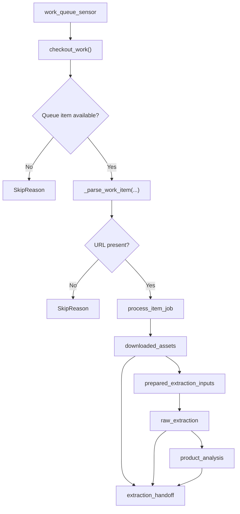

# Agents Pipeline

This document describes the current Dagster pipeline implemented in
`services/agents`.

## Purpose

The agents pipeline processes one queued scraped item at a time and extracts one
product tree from the scraped page.

It does not create catalog products. Django remains responsible for deciding how
an extracted product tree becomes catalog data.

## Runtime Entry Point

The Dagster code location entrypoint is:

- [definitions.py](/home/rafael/Documents/baboom/services/agents/agents/definitions.py)

That module assembles:

- all assets via `load_assets_from_modules([assets_module])`
- one asset job: `process_item_job`
- one sensor: `work_queue_sensor`

## High-Level Flow

One run executes this linear asset graph:

1. `work_queue_sensor` checks out one scraped item from Django
2. `downloaded_assets` normalizes the `ScrapedItem` and `ScrapedPage` context
3. `prepared_extraction_inputs` extracts API JSON and ordered image URLs
4. `raw_extraction` sends JSON context and images to the raw multimodal model
5. `product_analysis` converts raw text into one `ExtractedProduct`
6. `extraction_handoff` emits the final handoff payload without writing catalog data



## Product Extraction Contract

Structured extraction returns exactly one recursive product node:

```json
{
  "name": "Combo Whey + Creatina",
  "brand_name": "Black Skull",
  "weight_grams": 1500,
  "packaging": "OTHER",
  "quantity": 1,
  "category_hierarchy": [],
  "tags_hierarchy": [],
  "nutrition_facts": null,
  "flavor_names": [],
  "variant_name": null,
  "children": [
    {
      "name": "Whey",
      "brand_name": "Black Skull",
      "weight_grams": 1000,
      "packaging": "REFILL",
      "quantity": 1,
      "category_hierarchy": [],
      "tags_hierarchy": [],
      "nutrition_facts": null,
      "flavor_names": [],
      "variant_name": null,
      "children": []
    }
  ]
}
```

Rules:

- One scraped page yields one root product.
- A simple product has `children: []`.
- A combo or kit is represented by a root product with child products.
- Children use the same schema as the root product.
- Flavors, sizes, and nutrition-table variants do not become sibling products.

The schema lives in:

- [schemas.py](/home/rafael/Documents/baboom/services/agents/agents/schemas.py)

## Stage Boundaries

### `downloaded_assets`

Normalizes backend state for one scraped item.

Output:

- `url`
- `page_id`
- `origin_item_id`
- `store_slug`
- `source_page_api_context`
- `source_page_html_structured_data`

### `prepared_extraction_inputs`

Parses API-provided JSON and extracts ordered image URLs from:

- `ScrapedPage.api_context`
- `ScrapedPage.html_structured_data`

The agents service does not scrape HTML and does not materialize local image
candidate files.

### `raw_extraction`

Calls the raw multimodal model with:

- `[SCRAPER_CONTEXT]` JSON
- raw image URLs

Output:

- raw text report

### `product_analysis`

Calls the structured model once and returns one `ExtractedProduct`.

There are no semantic retries, no variant reconciliation, and no multi-product
publishing decisions in this stage.

### `extraction_handoff`

This asset only emits the final handoff payload:

```json
{
  "originScrapedItemId": 1,
  "sourcePageId": 10,
  "sourcePageUrl": "https://example.com/product",
  "storeSlug": "black_skull",
  "rawExtraction": "...",
  "product": {}
}
```

It does not call `createProduct`.
It does not create variants.
It does not create components.
It does not decide catalog identity.

## Backend API Usage

The agents service still uses Django GraphQL for queue/source operations:

- `checkout_work(...)`
- `get_scraped_item(...)`
- `ensure_source_page(...)`
- `report_error(...)`

Catalog writes are intentionally out of scope for the current Dagster pipeline.

## Error Handling

Assets that call external systems report failures back to Django with
`report_error(..., is_fatal=False)` and then re-raise so the Dagster run fails
visibly.

## Files Worth Reading Together

1. [definitions.py](/home/rafael/Documents/baboom/services/agents/agents/definitions.py)
2. [pipeline.py](/home/rafael/Documents/baboom/services/agents/agents/defs/pipeline.py)
3. [sensors.py](/home/rafael/Documents/baboom/services/agents/agents/defs/sensors.py)
4. [assets.py](/home/rafael/Documents/baboom/services/agents/agents/defs/assets.py)
5. [acquisition.py](/home/rafael/Documents/baboom/services/agents/agents/acquisition.py)
6. [extraction.py](/home/rafael/Documents/baboom/services/agents/agents/extraction.py)
7. [schemas.py](/home/rafael/Documents/baboom/services/agents/agents/schemas.py)
