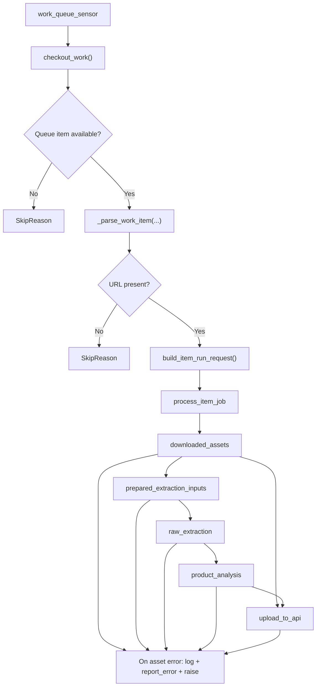
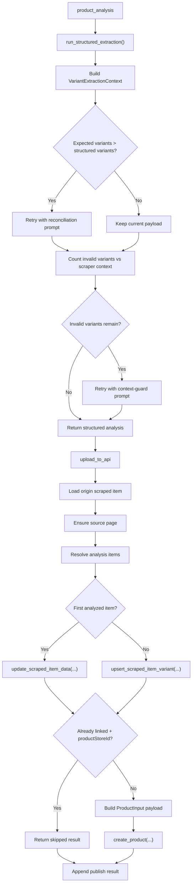

# Agents Pipeline

This document describes the current Dagster pipeline implemented in
`services/agents`.

It is intentionally code-driven: the goal is to translate the current runtime
behavior into technical prose, not to describe an aspirational design.

## Purpose

The agents pipeline processes one queued scraped item at a time and attempts to:

1. normalize the source page relationship for the queued item
2. read backend-provided scraper context from the linked source page
3. select ordered image URLs from that JSON context
4. run OCR or text-only multimodal extraction
5. convert raw extraction text into structured product analysis
6. create or update downstream products in the backend API

The pipeline is orchestrated by Dagster, but most of the domain work happens in
plain Python modules under `agents/acquisition.py`, `agents/extraction.py`,
`agents/publishing.py`, `agents/brain.py`, and `agents/client.py`.

## Runtime Entry Point

The Dagster code location entrypoint is:

- [definitions.py](/home/rafael/Documents/baboom/services/agents/agents/definitions.py)

That module assembles:

- all assets via `load_assets_from_modules([assets_module])`
- one asset job: `process_item_job`
- one sensor: `work_queue_sensor`

The effective code location object is `defs = Definitions(...)`.

## High-Level Flow

At a high level, one run looks like this:

1. `work_queue_sensor` polls the backend queue
2. the sensor receives one checkout payload from the backend API
3. the sensor normalizes that payload into a `QueueWorkItem`
4. the sensor creates a `RunRequest` with run config for the item
5. Dagster launches `process_item_job`
6. the asset graph executes in this order:
   - `downloaded_assets`
   - `prepared_extraction_inputs`
   - `raw_extraction`
   - `product_analysis`
   - `upload_to_api`

## Flowcharts





## Pipeline Contract

The shared launch contract for queue-triggered runs lives in:

- [pipeline.py](/home/rafael/Documents/baboom/services/agents/agents/defs/pipeline.py)

### Job Name

The job name is fixed as:

- `process_item_job`

### Per-Run Config

Each launched run receives the same config payload for these assets:

- `downloaded_assets`
- `product_analysis`
- `upload_to_api`

The shared config shape is:

```python
{
    "ops": {
        op_name: {
            "config": {
                "item_id": int,
                "url": str,
                "store_slug": str,
            }
        }
    }
}
```

This config is built by `build_item_run_config(...)`.

### Queue Item Model

The normalized launch payload is the `QueueWorkItem` dataclass:

```python
QueueWorkItem(
    item_id: int,
    url: str,
    store_name: str,
    store_slug: str,
)
```

### Run Identity

Runs use:

- `run_key = str(item_id)`

This means the queue item ID is the deduplication identity for Dagster run
launches.

## Sensor

The sensor lives in:

- [sensors.py](/home/rafael/Documents/baboom/services/agents/agents/defs/sensors.py)

### What It Does

The sensor is intentionally thin. Its responsibilities are:

1. call `AgentClient.checkout_work()`
2. normalize the backend response into a `QueueWorkItem`
3. return `SkipReason` when the queue is empty
4. return `SkipReason` when the payload has no usable URL
5. emit `RunRequest` for valid work

### Polling Behavior

The sensor is configured with:

- `minimum_interval_seconds=10`
- `default_status=RUNNING`

### Queue Payload Requirements

The sensor expects the backend checkout response to contain:

- `id`
- `productLink` or `sourcePageUrl`
- optionally `storeName`
- optionally `storeSlug`

If neither `productLink` nor `sourcePageUrl` is present, the item is skipped.

## Stage Boundaries

The pipeline is now split into three logical parts:

1. Acquisition / preparation
   - `downloaded_assets`
   - `prepared_extraction_inputs`
2. Non-deterministic extraction
   - `raw_extraction`
   - `product_analysis`
3. Publishing / synchronization
   - `upload_to_api`

The key boundary is `prepared_extraction_inputs`: it is the deterministic
handoff between source acquisition and the LLM-driven extraction flow.

The deterministic stage is now API-first:

- `downloaded_assets` does not download HTML
- `prepared_extraction_inputs` does not materialize image candidates from local
  storage
- all three stages consume the JSON context already persisted by Django in
  `ScrapedPage.raw_content`

Prompt loading is part of the extraction layer, not the agent-wrapper layer:

- [extraction.py](/home/rafael/Documents/baboom/services/agents/agents/extraction.py)
  loads prompt files from `agents/prompts/`
- [brain.py](/home/rafael/Documents/baboom/services/agents/agents/brain.py)
  requires `prompt` explicitly
  for both raw and structured extraction wrappers

This means the `brain` modules can be executed directly from plain Python
without Dagster UI or Dagster runtime, as long as the caller passes a prompt and
model configuration.

For combo products, `upload_to_api` now sends rich component payloads instead of
identifier-only payloads. Components may include the same product-like fields
used by the main product payload, such as weight, brand, taxonomy, packaging,
nutrition, and tags, whenever extraction produces those values.

## External Systems

The pipeline talks to three main infrastructure boundaries.

### Backend API

Implemented by:

- [client.py](/home/rafael/Documents/baboom/services/agents/agents/client.py)

Important backend operations:

- `checkout_work(...)`
- `get_scraped_item(...)`
- `ensure_source_page(...)`
- `update_scraped_item_data(...)`
- `upsert_scraped_item_variant(...)`
- `create_product(...)`
- `report_error(...)`

The client uses:

- `AGENTS_API_URL`
- `AGENTS_API_KEY`

It sends GraphQL requests over HTTP with retries for transient upstream errors.

### API-First Deterministic Inputs

Instead, it relies on fields already exposed by the backend GraphQL API:

- `sourcePageUrl`
- `sourcePageId`
- `sourcePageRawContent`
- `sourcePageContentType`

The expectation is that Django scrapers already persisted a structured JSON
payload into `ScrapedPage.raw_content`, and the agents pipeline consumes that
JSON directly.

## Asset-by-Asset Walkthrough

### 1. `downloaded_assets`

Source:

- [assets.py](/home/rafael/Documents/baboom/services/agents/agents/defs/assets.py)
- [acquisition.py](/home/rafael/Documents/baboom/services/agents/agents/acquisition.py)

#### Inputs

- Dagster config:
  - `item_id`
  - `url`
  - `store_slug`
- resources:
  - `client`

#### Step Logic

1. load the current scraped item from the backend API
2. determine the effective page URL:
   - prefer `sourcePageUrl`
   - then `productLink`
   - then the run config URL
3. determine the effective store slug:
   - prefer backend item `storeSlug`
   - then run config `store_slug`
4. call `ensure_source_page(...)` so the scraped item is linked to a source page
5. read the resulting `sourcePageId`
6. carry forward `sourcePageRawContent` and `sourcePageContentType`
7. return a normalized payload for downstream assets

#### Output Payload

The asset returns a dict with:

- `url`
- `page_id`
- `origin_item_id`
- `store_slug`
- `source_page_raw_content`
- `source_page_content_type`

#### Error Behavior

On failure:

- logs the error in Dagster
- reports the error back to the backend via `report_error(item_id, ..., is_fatal=False)`
- re-raises the exception

### 2. `prepared_extraction_inputs`

Source:

- [assets.py](/home/rafael/Documents/baboom/services/agents/agents/defs/assets.py)
- [acquisition.py](/home/rafael/Documents/baboom/services/agents/agents/acquisition.py)

#### Inputs

- `downloaded_assets`

#### Step Logic

1. parse `sourcePageRawContent` when `sourcePageContentType == "JSON"`
2. extract image URLs directly from JSON fields such as:
   - `images`
   - `items[].images`
3. preserve gallery order using the original image positions
4. determine extraction mode:
   - `multimodal` when image URLs exist
   - `text_only` otherwise

#### Output Type

The asset returns:

- `PreparedExtractionInputs`

### 3. `raw_extraction`

Source:

- [assets.py](/home/rafael/Documents/baboom/services/agents/agents/defs/assets.py)

#### Inputs

- `prepared_extraction_inputs`
- resources:
  - `client`

#### Step Logic

1. read the selected image URLs from `prepared_extraction_inputs`
2. determine extraction mode:
   - `multimodal` when image URLs exist
   - `text_only` otherwise
3. build the LLM description payload by concatenating:
   - `[SCRAPER_CONTEXT]` context block
4. call `run_raw_extraction(...)`
5. store timing and extraction metadata in Dagster output metadata

#### Output Type

The asset returns:

- `str`

This string is the raw multimodal extraction text that feeds structured
analysis.

#### Notes

The OCR asset is the stage that bridges API-provided JSON and image URLs into
LLM-ready raw extraction text.

### 4. `product_analysis`

Source:

- [assets.py](/home/rafael/Documents/baboom/services/agents/agents/defs/assets.py)
- [extraction.py](/home/rafael/Documents/baboom/services/agents/agents/extraction.py)

#### Inputs

- Dagster config:
  - `item_id`
  - `url`
  - `store_slug`
- upstream:
- `raw_extraction`

#### Step Logic

1. delegate the semantic analysis policy to `run_analysis_pipeline(...)`
2. inside that pipeline, derive `VariantExtractionContext` from OCR text:
   - expected variant count inferred from OCR
   - allowed variants inferred from scraper context block
3. run the base structured extraction using `run_structured_extraction(...)`
4. count how many variants the structured payload produced
5. if OCR implies multiple variants but the structured result under-detects them:
   - rerun extraction with a reconciliation prompt
6. count invalid variants relative to the allowed scraper-context variants
7. if structured output contains invalid variants:
   - rerun extraction with a context-guard prompt
8. build `StructuredAnalysisResult`
9. publish analysis metadata to Dagster

#### Output Type

The asset returns:

- `dict`

The Dagster asset itself is now intentionally thin. It is responsible for:

- calling `run_analysis_pipeline(...)`
- logging retry decisions
- emitting Dagster metadata
- reporting fatal errors back to the backend API

The semantic retry policy now lives in the pure Python module:

- [extraction.py](/home/rafael/Documents/baboom/services/agents/agents/extraction.py)

Expected shape:

```python
{
    "items": [
        {
            "name": ...,
            "variant_name": ...,
            "packaging": ...,
            "weight_grams": ...,
            "nutrition_facts": ...,
            ...
        }
    ]
}
```

#### Retry Semantics

This stage contains semantic retries, not infra retries:

- reconciliation retry:
  - used when OCR suggests more variants than the structured payload produced
- context guard retry:
  - used when the structured payload proposes variants outside the allowed
    scraper/catalog context

### 5. `upload_to_api`

Source:

- [assets.py](/home/rafael/Documents/baboom/services/agents/agents/defs/assets.py)

#### Inputs

- Dagster config:
  - `item_id`
  - `url`
  - `store_slug`
- resource:
  - `client`
- upstream:
  - `product_analysis`
  - `downloaded_assets`

#### Step Logic

1. load the origin scraped item from the backend
2. ensure it is associated with a source page
3. create `PublishOriginContext`
4. resolve the final list of analyzed items:
   - use `product_analysis["items"]` when present
   - otherwise create a single fallback item using metadata/name
5. iterate over each analyzed item

Per analyzed item:

1. resolve which scraped item backs the analyzed item
2. for the first analyzed item:
   - update the origin scraped item fields
3. for additional analyzed items:
   - create or update a variant scraped item with a deterministic external ID
4. if the scraped item is already linked and has `productStoreId`:
   - skip product creation
   - return a synthetic skipped result
5. otherwise build the downstream `ProductInput` payload
6. call `create_product(...)`

#### Variant External IDs

Derived variant scraped items use an external ID built from:

- origin external ID
- variant index
- slugified base name
- slugified variant name

This keeps multi-item pages deterministic across reruns.

#### Output Type

The asset returns:

- `list[dict]`

Each entry is either:

- the GraphQL `createProduct` result
- or a synthetic skipped result for already linked items

#### Skip Logic

The pipeline skips publishing when:

- scraped item status is `linked`
- and `productStoreId` exists

This prevents duplicate product creation for already linked scraped items.

## Shared Data Shapes

Several normalized dataclasses are used inside the pipeline to reduce
ambiguity.

### `QueueWorkItem`

Represents the minimum launchable queue item.
It now lives in:

- [pipeline.py](/home/rafael/Documents/baboom/services/agents/agents/defs/pipeline.py)

### `SourcePageContext`

Represents the normalized source-page state needed by `downloaded_assets`.
It now lives in:

- [acquisition.py](/home/rafael/Documents/baboom/services/agents/agents/acquisition.py)

### `VariantExtractionContext`

Represents structured-analysis expectations derived from OCR and scraper context.

### `StructuredAnalysisResult`

Represents the final structured payload plus retry metadata.

### `PublishOriginContext`

Represents the normalized backend state needed while publishing items.
It now lives in:

- [publishing.py](/home/rafael/Documents/baboom/services/agents/agents/publishing.py)

### `PublishItemResult`

Represents the per-item publish result plus bookkeeping about whether a variant
scraped item was created.
It now lives in:

- [publishing.py](/home/rafael/Documents/baboom/services/agents/agents/publishing.py)

## Error Handling Model

Across the pipeline, the error strategy is consistent:

1. catch exceptions inside the asset
2. log the failure to the Dagster run log
3. report the failure to the backend API with `report_error(...)`
4. re-raise the exception so the Dagster run fails visibly

This means the backend remains informed of processing failures even when Dagster
marks the run as failed.

## Input Boundaries

The main pipeline is now API-first.

The deterministic half consumes:

- `sourcePageRawContent` from the backend API
- `sourcePageContentType`
- image URLs already present in that JSON payload

The agents service no longer relies on local scraper-produced HTML, site-data
files, or persisted OCR candidate manifests in the main path.

## Technical Observations

The current pipeline shape is:

- sensor-driven
- one queued item per Dagster run
- mostly linear asset execution
- backend API as the system of record
- API JSON as the deterministic boundary
- LLM-assisted extraction in two stages:
  - raw extraction
  - structured extraction

The most important orchestration boundaries are:

- queue checkout
- source page normalization
- prepared extraction inputs
- OCR/raw extraction
- structured analysis with semantic retries
- publish with origin/variant bookkeeping

## Files Worth Reading Together

For the shortest path to understanding the pipeline in code:

1. [definitions.py](/home/rafael/Documents/baboom/services/agents/agents/definitions.py)
2. [pipeline.py](/home/rafael/Documents/baboom/services/agents/agents/defs/pipeline.py)
3. [sensors.py](/home/rafael/Documents/baboom/services/agents/agents/defs/sensors.py)
4. [assets.py](/home/rafael/Documents/baboom/services/agents/agents/defs/assets.py)
5. [assets.py](/home/rafael/Documents/baboom/services/agents/agents/defs/assets.py)
6. [assets.py](/home/rafael/Documents/baboom/services/agents/agents/defs/assets.py)
7. [assets.py](/home/rafael/Documents/baboom/services/agents/agents/defs/assets.py)
8. [client.py](/home/rafael/Documents/baboom/services/agents/agents/client.py)
